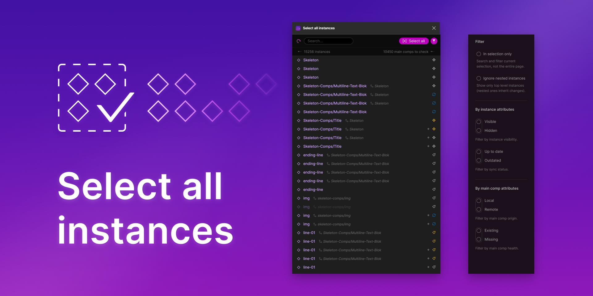

# Select all instances

Swiss army knife for component instance inspection and selection.

Try it out:
[Figma Plugin - Select all instances](https://www.figma.com/community/plugin/893141488737748075)




### Features

- Flexible instance selection: adjust the filters > select all instances.
- Inspect main component info for each instance: local/remote, existing/missing.
- Search by term: exact match with `"term"` or `"term`).
- Search in current selection to find children instances for any node type:
  sections, frames, etc.
- Filter out nested instances: allows working only with instances inside main
  components, so that nested ones can inherit the changes without overrides.* 
- Filter visible/hidden instances.
- Filter up-to-date/outdated instances.
- Filter local/remote components.
- Filter missing/existing components.

## Dev

Run:

```
npm install
```

Build:

```
npm run build
```

Watch:

```
npm run watch
```

----

Linting:

```
trunck check
```

--


LICENSE: <span xmlns:cc="http://creativecommons.org/ns#" xmlns:dct="http://purl.org/dc/terms/"><a property="dct:title" rel="cc:attributionURL" href="https://github.com/morekid/select-all-instances">Select all instances</a> © 2020 by <a rel="cc:attributionURL dct:creator" property="cc:attributionName" href="https://github.com/morekid">Daniele De Matteis</a> is licensed under <a href="http://creativecommons.org/licenses/by-nc-nd/4.0/?ref=chooser-v1" target="_blank" rel="license noopener noreferrer" style="display:inline-block;">CC BY-NC-ND 4.0</a></span>